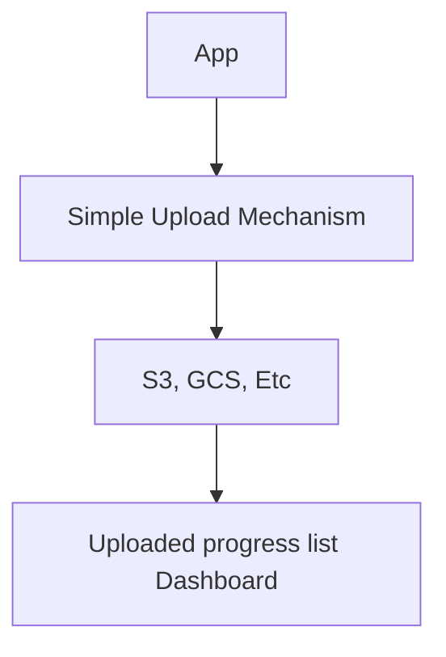
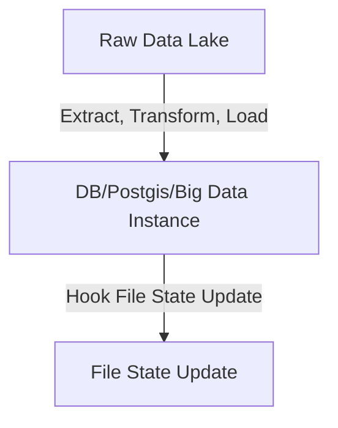

# System Roadmap

- Demo: https://geo-sys.vercel.app
- [Sample geojson file](https://github.com/agungyuliaji/geo-sys/blob/master/public/sample.geojson)
- NextJs Frontend
- In-browser GeoJSON processing
- Code structures plan:
  - src
    - app (nextjs app and pages)
    - components
      - common (small components)
        - Button
        - Badge
        - Icon
      - elements (mid reusable components)
        - Card
        - Modal
      - features (components specifics feature integration)
        - Feature A
          - Feature A spesific component 1
          - Feature A spesific component 2
        - Feature B
        - Feature C
- test unit (`__test__`) files are in each component folder

## Work in Progress
- Backend
- User Authentication
- Data Storage and Processing

### Backend Data Processing
#### Simple upload
The client-side process involves only File Uploads (saved into S3, GCS, or other file storage solutions) and is considered complete once the upload is finished (without geo data DB sync). Users are then redirected to a dashboard that shows the progress of uploaded files. The list managed by a background service.




#### Background Service
Lets call it => the Data Lake (where uploaded files are stored in File Storage + meta indentifier attribute stored in DB), the workflow involves extracting, transforming, and loading data into a database (or a big data instance, e.g., BigQuery). A hook callback updates the state of the uploaded file list on the user's dashboard to reflect this process.



### GeoJSON Object Types Definitions and Parsing

- **Point:** the "coordinates" member represents a single position.
- **MultiPoint:** type's "coordinates" member is an array of positions.
- **LineString:** the "coordinates" member is an array of two or more positions.
- **MultiLineString:** coordinates are arrays of LineString coordinate arrays.
- **MultiPolygon:** the "coordinates" member is an array of Polygon coordinate arrays.
- **GeometryCollection:** A GeoJSON object with the type "GeometryCollection" is considered a Geometry object. It has a "geometries" member, the value of which is an array. Each element in this array is a GeoJSON Geometry object, allowing for the collection of various geometry types. Example:


```geojson
{
  "type": "FeatureCollection",
  "features": [
    {
      "type": "Feature",
      "geometry": {
        "type": "Polygon",
        "coordinates": [
          [
            [
              -121.353637,
              40.584978
            ],
            [
              -121.284551,
              40.584758
            ],
            [
              -121.275349,
              40.541646
            ],
            [
              -121.246768,
              40.541017
            ],
            [
              -121.251343,
              40.423383
            ],
            [
              -121.32687,
              40.423768
            ],
            [
              -121.360619,
              40.43479
            ],
            [
              -121.363694,
              40.409124
            ],
            [
              -121.439713,
              40.409197
            ],
            [
              -121.439711,
              40.423791
            ],
            [
              -121.572133,
              40.423548
            ],
            [
              -121.577415,
              40.550766
            ],
            [
              -121.539486,
              40.558107
            ],
            [
              -121.520284,
              40.572459
            ],
            [
              -121.487219,
              40.550822
            ],
            [
              -121.446951,
              40.56319
            ],
            [
              -121.370644,
              40.563267
            ],
            [
              -121.353637,
              40.584978
            ]
          ]
        ]
      }
    },
    {
      "type": "Feature",
      "geometry": {
        "type": "Point",
        "coordinates": [
          -121.415061,
          40.506229
        ]
      }
    },
    {
      "type": "Feature",
      "geometry": {
        "type": "Point",
        "coordinates": [
          -121.505184,
          40.488084
        ]
      }
    },
    {
      "type": "Feature",
      "geometry": {
        "type": "Point",
        "coordinates": [
          -121.354465,
          40.488737
        ]
      }
    }
  ]
}
```